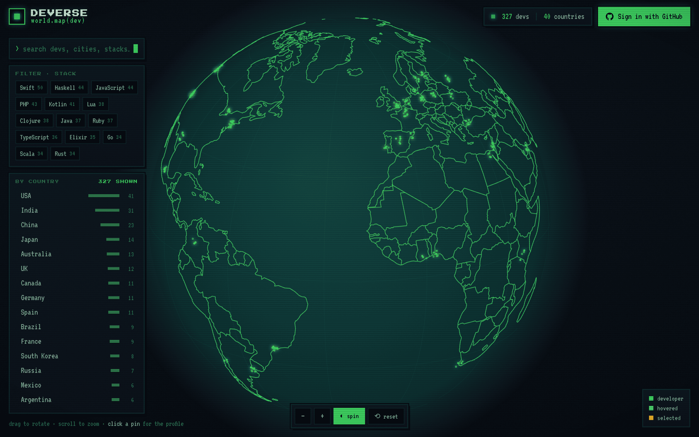
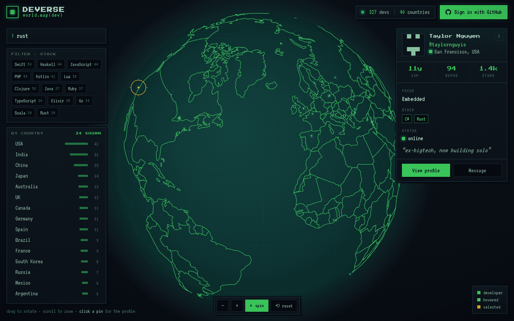
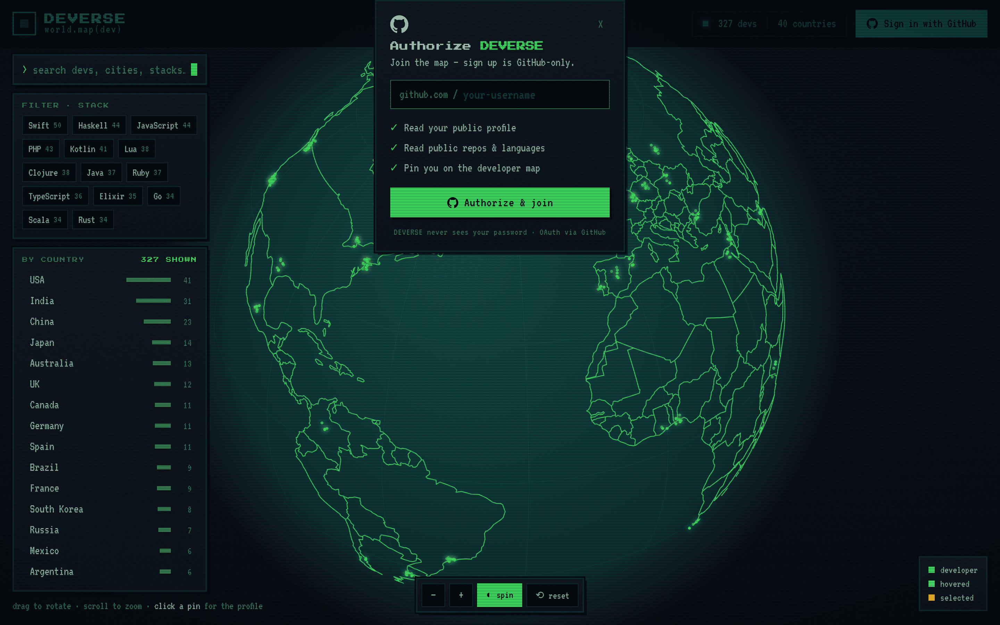

# DEVERSE — World Map of Developers

A retro pixel-art / CRT world map of the global developer community. Implemented
from a Claude Design handoff bundle as a real **Vite + React** app.



## Screenshots

| Developer profile | Sign in with GitHub |
| --- | --- |
|  |  |

## What's here

- **3D vector globe** rendered to canvas with **real country outlines** (neon-green
  borders on a dark sphere). Borders come from bundled `world-atlas` (110m) geometry
  projected onto the sphere with back-face culling — no network call at runtime.
- **327 seeded fictional developers** across 50 real cities, each with stack, focus,
  experience, repos, stars, status, and a generated pixel-art identicon.
- **Pulsing pins** — hover for a tooltip, click to recenter the globe and open a
  detailed profile card.
- **Search** (devs / cities / stacks; `Enter` selects the first match), **stack
  filters** (non-matching pins dim), and a clickable **by-country** list.
- **Sign in with GitHub** — GitHub-only signup via a mocked OAuth flow, with a
  persistent connected state.
- Full CRT chrome: scanlines, vignette, grain, flicker, boot screen, and the
  Press Start 2P + VT323 fonts.

## Run it

```bash
npm install
npm run dev      # start the dev server
npm run build    # production build → dist/
npm run preview  # serve the production build
```

## Structure

| File | Role |
| --- | --- |
| `src/data.js` | Seeded developer dataset (stable across reloads) |
| `src/geo.js` | Builds country-outline line rings from bundled world-atlas |
| `src/Globe.jsx` | Canvas vector-globe engine (projection, pins, interaction) |
| `src/App.jsx` | UI: top bar, GitHub auth, search, filters, profile panel |
| `src/styles.css` | Retro pixel-art / CRT visual system |
